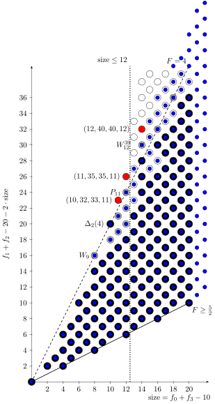

# Small polytopes

Here we present some small 4-polytopes and sagemath code how to generate them.

##

- `sage`: contains the code to generate the polytopes
- `small_fat_4_polys`: contains the polytopes
- `tex`: contains some explanation in <a href="./tex/small_fat_4_polys.pdf">small_fat_4_polys.pdf</a>

## Contributing

See [`CONTRIBUTING.md`](CONTRIBUTING.md) for details.

## License

Apache 2.0; see [`LICENSE`](LICENSE) for details.

## Disclaimer

This project is not an official Google project. It is not supported by
Google and Google specifically disclaims all warranties as to its quality,
merchantability, or fitness for a particular purpose.